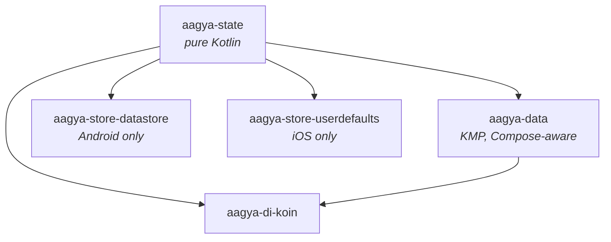
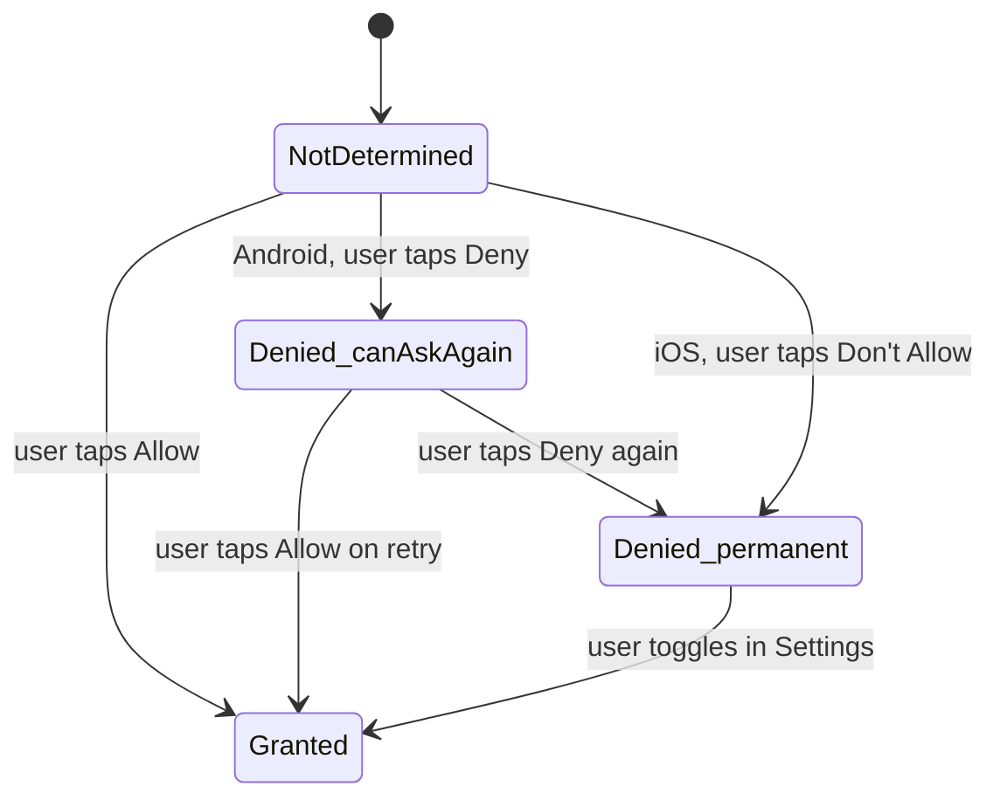

# Architecture

Aagya is intentionally small. The whole library is three layers, each with a single job.

## Module map

| Module | What it owns | Required? |
|---|---|---|
| **`state`** | The vocabulary: `AppPermission`, `PermissionStatus`, `PermissionResult`, `PermissionPolicy`, `PermissionStore` interface, `Logger` interface, `InMemoryPermissionStore`. | Yes |
| **`data`** | The behavior: `PermissionController` interface, Android impl using `ActivityResultContracts`, iOS impl using `CLLocationManager`. | Yes |
| **`store-datastore`** | Persistent `PermissionStore` backed by Jetpack DataStore. | Optional |
| **`store-userdefaults`** | Persistent `PermissionStore` backed by `NSUserDefaults`. | Optional |
| **`di-koin`** | Koin module factory if you use Koin. | Optional |

The state module has no runtime dependencies beyond `kotlinx-coroutines-core` (used by
the `Mutex` inside `InMemoryPermissionStore`). The data module pulls in
`compose.runtime` so it can expose Composable factories, plus AndroidX activity and
lifecycle bindings on Android.

## Cross-platform state machine

Both platforms surface the same conceptual states:

`Denied_canAskAgain` is the state that requires the most care in the UI. The system
sentinel is different on each platform:

- **Android**: `ActivityCompat.shouldShowRequestPermissionRationale(activity, perm)` returns `true`.
- **iOS**: never. iOS does not have this concept. After the first denial, you are
  permanently denied for the lifetime of the app.

Aagya hides this difference by surfacing `PermissionStatus.Denied(canAskAgain: Boolean)`
and computing the value correctly on each platform.

## Threading model

- All `suspend` functions are safe to call from any dispatcher.
- Each platform marshals to the platform main thread internally where required (Android
  for `ActivityCompat`, iOS for `CLLocationManager`).
- The `PermissionStore` interface is required to be safe under concurrent reads and
  writes for the same key. The built-in `InMemoryPermissionStore` uses a `Mutex`;
  the DataStore and `NSUserDefaults` adapters inherit thread-safety from their
  underlying APIs.

## Crash safety

Aagya never throws across its public API. Every outcome is a `sealed` value:

- `PermissionResult.Granted | Denied | Cancelled | PolicyExhausted`
- `PermissionStatus.NotDetermined | Granted | Denied | Restricted`

Internal failures (missing `Activity`, `NSURL.URLWithString` returning null,
`CLLocationManager` errors) are logged through the configured `Logger` and surfaced as
`PermissionResult.Denied(reason = PlatformError)`.

The one place Aagya can throw is during construction: if `rememberPermissionController()`
cannot find a `ComponentActivity` in the current `Context` chain on Android, it throws
`IllegalStateException` immediately. This is a developer error, not a runtime
condition.

## What Aagya refuses to do

- **Hide platform differences when they matter.** Android allows two prompts; iOS allows
  one. The default Aagya policy reflects this. If you want stricter behavior, opt in.
- **Pick a storage solution for you.** The default is in-memory. Use the storage adapter
  that fits your stack, or write your own.
- **Take a hard dependency on a DI framework.** Koin support exists in a separate
  optional module.
- **Manage activity lifecycle for you.** The `ActivityResultLauncher` registration is
  bound to the current Composable's lifetime via `rememberLauncherForActivityResult`,
  which is the official Compose contract for this. No background services, no
  Application subclasses.
